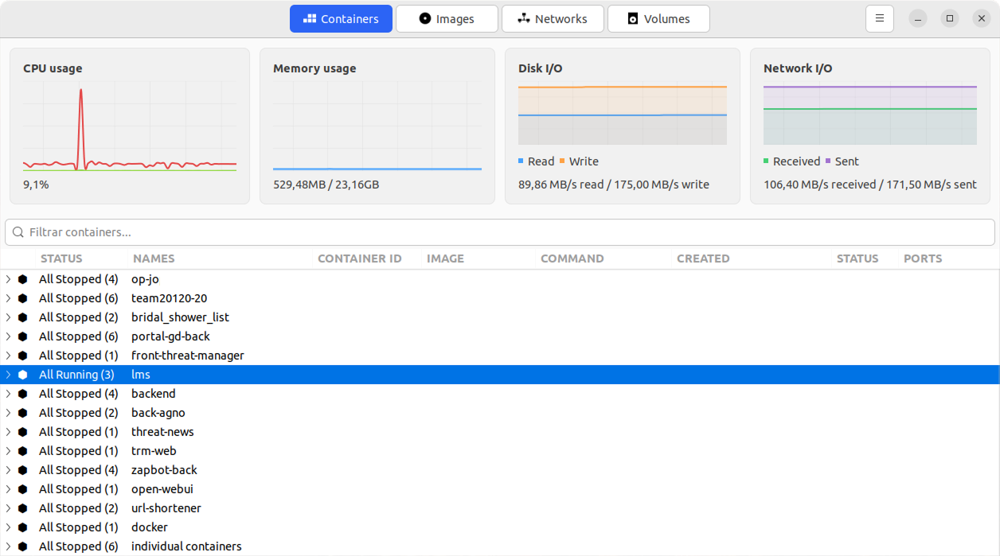

# Dodo
A desktop GTK3-powered C++ client that lets you manage Docker from the local machine.



## Requirements

- C++ compiler (g++)
- GTK3 development libraries
- pkg-config

### Installation on Ubuntu/Debian

```bash
sudo apt-get update
sudo apt-get install build-essential libgtk-3-dev pkg-config
```

## Build

Run the following command to compile the project:

```bash
make
```

This produces the `dodo` executable.

## Execution

To run the program:

```bash
./dist/dodo
```

## Clean

To remove the compiled artifacts:

```bash
make clean
```
